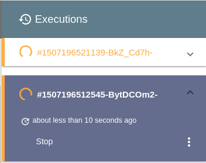
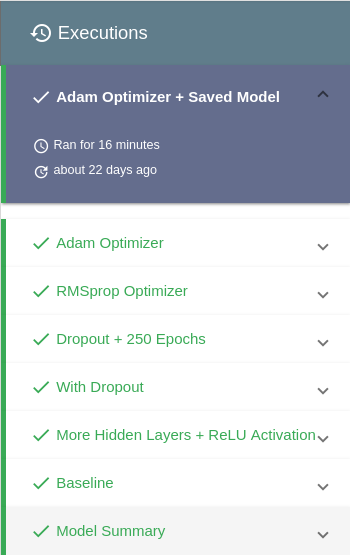

## Overview

Executions are a core concept of the MachineLabs workflow. When we want to perform a certain code a new execution is started. An execution consists of three stages.

- **1. Fetching all inputs** and placing them into the special `inputs` directory before the actual code is performed.

- **2. Performing the actual code** with the specified parameters. This operation may run over long durations (days, potentially infinite) and all `stdout` / `stderr` is streamed and can be observed in real time in the console view.

- **3. Uploading all outputs** that were saved to the special `outputs` directory. Read more about that in the [Outputs Guide](outputs.html).

## Configuring Executions

When we perform executions, there are certain things that can be configured. The single point of truth for all the different possible configurations is the `ml.yaml` file in the root directory of our lab.

### Execution Environment

Each executions runs in on a pre-configured server which comes with all the software that is needed by our code. However, there's no one-fits-all solution. For instance, we may want to decide between different Deep Learning frameworks or their specific versions

MachineLabs provides a wide range of different configurations which we can specify via the `dockerImageId`. The default value for the `dockerImageId` is `keras_v2-0-x_python_3-1` which gives us access to an environment with Python 3.1, Keras 2.0.x and a bunch of other libraries.

We can read more about all the different possible environments in the [Environments Guide](environments.html)

### Script Parameters

We often want to expose a certain set of parameters for our scripts to control things which shouldn't be set in stone and depend on the specific task at hand.

Such parameters can be defined in the `parameters` section of the `ml.yaml` file.

```yaml
parameters:
    - pass-as: 'inputs/base_image.jpg'
    - pass-as: 'inputs/style_image.jpg'
    - pass-as: 'outputs/generated_'
    - pass-as: '--iter=10'
```

Parameters are passed in the defined order, making it possible to pass positional arguments as well as any other kind of parameters such as flags or key value pairs.

### Inputs

Executions can be configured to fetch files before the actual code execution starts. We configure such files in the `inputs` section of the `ml.yaml` file.

```yaml
inputs:
    - name: mnist.npz
      url: https://s3.amazonaws.com/img-datasets/mnist.npz
```

An input consists of the `url` where the file can be downloaded from and the `name` that should be used to save it. Each file is then downloaded into the special `inputs` directory.

The name that we specify for the input doesn't have to match the actual download name so that we can give different names to files that would otherwise conflict with their names. Notice though that it is mandatory to specify a name for each input even if we don't need a different name.

## Starting Executions

To start an execution, click the *Run* button.


This will kick off a new execution which immediately appears on the sidebar.


## Viewing Executions

When we start an execution, we directly start observing its `stdout` and `stderr` output. That doesn't mean we have to continue watching it for the entire performance. In fact, as Machine Learning tasks usually take some time to perform, we often want to try out different approaches and start multiple executions in parallel.

As we start other executions in our lab, each of them is placed in the sidebar.



We can jump back and forth between all the different executions that are listed in the sidebar. Every time we select an execution from the sidebar the *Code* and the *Output* view change accordingly.

The directory of the *Code* view is set to the exact state of directory from the execution. In other words, to the version of the code at the time of when the execution was started.

The *Output* view starts observing the executions `stdout` and `stderr` messages of the selected execution.

<p class="tip">Notice that every time we start observing an execution that already has produced a large amount of output, the console view presents us with a reasonable sized **chunk from the beginning**, a reasonable sized **chunk from the end** in addition to all **further live messages**

If the produced output is still reasonable small, all messages are presented to us.
</p>

## Stopping Executions

Executions can be stopped as soon as they appear as *running* on the sidebar. To stop an execution, click the *Stop* button.

## Restarting Executions

If you want to restart an execution, find it in the sidebar and select *Restart*.

Technically, restarting an execution is no different from selecting an execution (See [Vieweing Executions](executions.html/#viewing-executions)) and clicking *Run* run.

In other words, reset the code to the state of the choosen execution and start a new execution.

## Deleting Executions

As we develop, executions add up and not all of the executions are worth keeping forever. For instance, a small typo may make an execution fail because of a syntactic error.

If we decide to delete an execution, all we have to do is to click on the three dots and select *Remove*.

## Naming Executions

Each execution is assigned an unique id which is also used as the default name. We can also give our execution a more descriptive name by clicking the three dots and selecting *Edit*

This can make the executions of a lab far more descriptive than leaving the default names.



