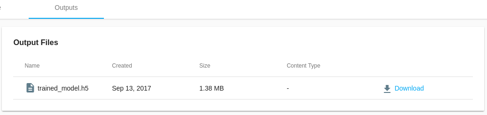

When doing Machine Learning, we often want to persist generated assets such as the trained model, graphics or logs. The trained model could later be used to build applications or as a starting point for another training.

## Saving output

Saving output files with MachineLabs is really simple. All files that we write to the `outputs` directory are uploaded when the code finished executing.

Files become available in the *Outputs* view of the execution.

During our **Public Beta Program** a maximum of 5 files, each with a maximum file size of 150 MB can be persisted

## Downloading saved output

We can download saved outputs by clicking on *Download* at the specific file that we want to download from the outputs view.

