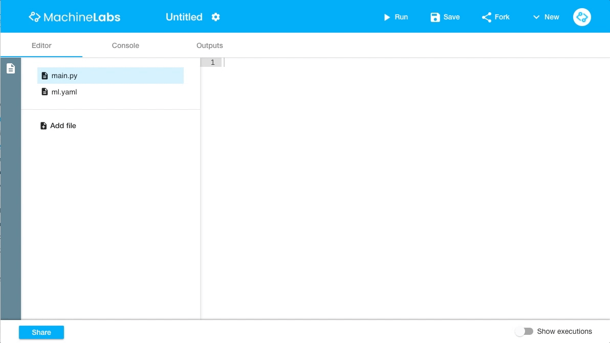
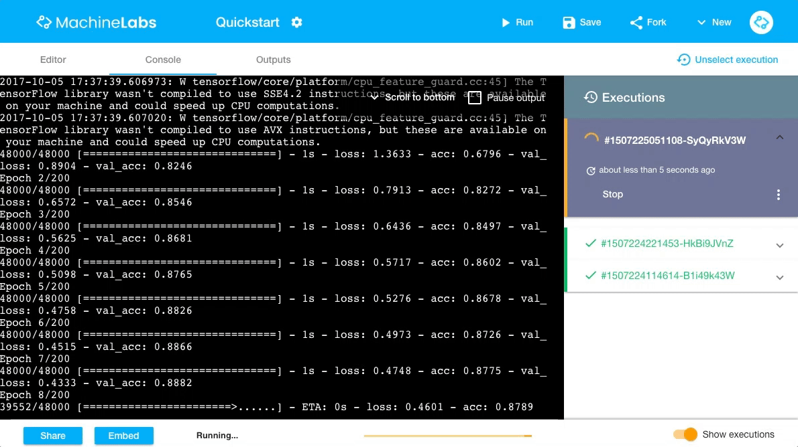
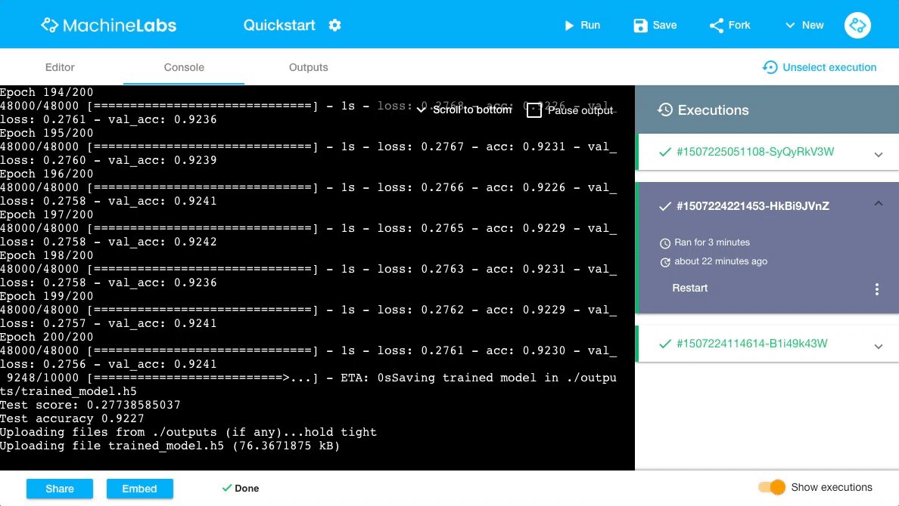

<p class="tip">MachineLabs is currently in private beta. <strong>To follow this quickstart you need to be part of the private beta program</strong>. If you haven't done so yet, login at <a href="https://machinelabs.ai/editor" title="MachineLabs Editor">machinelabs.ai</a> to become part of the next batch. We onboard new users weekly.</p>

## Introduction

This quickstart will teach us the basics on how to get up and running with MachineLabs. We'll be creating our first lab and use Keras with TensorFlow and the MNIST dataset, to train a simple model to learn how to recognize hand-written digits.

For more in-depth details on the data and the model, please refer to [the TensorFlow documentation](https://www.tensorflow.org/get_started/mnist/pros).

## Creating your first lab

MachineLabs is all about creating labs. A lab is a project, or experiment, that can be executed in the MachineLabs cloud. Labs can be used for quick demos we might want to share with our colleagues and friends, as well as serious data science problems that require several hours of execution time on high performance hardware.

To create a lab, click the *New* button in the top right corner of the toolbar in MachineLabs editor view. We can either choose to create a blank lab from scratch, or create a lab from an existing template. For the purpose of this quickstart guide, we create a blank lab.



## Getting the dataset

To train our model we need to get access to the [MNIST dataset](http://yann.lecun.com/exdb/mnist/). We're using [Keras](https://keras.io) in this quickstart guide and it turns out that it makes it really easy to use the MNIST dataset by simply importing it straight from `keras.datasets`. However, for the purpose of this quickstart we'd rather like to fetch it manually so that we learn how to work with datasets when using the MachineLabs platform.

Every lab comes with an `ml.yaml` file by default that sets important configurations for when the lab gets [executed](executions.html), such as the container in which it will run, or the input data it needs to perform its work. To fetch the MNIST dataset before our lab starts its execution, all we have to do is to add the following section to the `ml.yaml` file:

```yaml
inputs:
    - name: mnist.npz
      url: https://s3.amazonaws.com/img-datasets/mnist.npz
```

This configures our lab to fetch the `mnist.npz` from the specified url and save it to `inputs/mnist.npz`. Notice that `inputs` is a special folder inside our lab's execution directory, which all our configured inputs are downloaded to before the actual execution of the lab starts.

If you want to learn more about what can be configured in a lab's `ml.yaml`, head over to our guide on [how to configure labs](configuring-labs.html).

<p class="tip">The name that we specify for the input doesn't have to match the actual download name. This enables us to give different names to files that would otherwise conflict with their names. **However, it is mandatory to specify a name for each input** even if we don't need a different name.</p>

## Writing the code

Now that we've wired up our lab to get the data it needs, let's write the code that makes a neural net learn how to recognize hand-written digits!

Every time a lab is created, we not only get an `ml.yaml` file for configuration, but also a `main.py` file that is our main entry point of our lab code. Let's take the code below and copy it over into our `main.py` file.

```python
from __future__ import print_function
import numpy as np
from keras.models import Sequential
from keras.layers.core import Dense, Activation
from keras.optimizers import SGD
from keras.utils import np_utils


# Defines a function to load the MNIST dataset from a local path
def load_data(path):
    f = np.load(path)
    x_train, y_train = f['x_train'], f['y_train']
    x_test, y_test = f['x_test'], f['y_test']
    f.close()
    return (x_train, y_train), (x_test, y_test)

np.random.seed(1671) # for reproducibility

# network and training

NB_EPOCH = 200
BATCH_SIZE = 128
VERBOSE = 1
NB_CLASSES = 10 # number of outputs = number of digits
OPTIMIZER = SGD()
N_HIDDEN = 128
VALIDATION_SPLIT= 0.2 # how much TRAIN is reserved for VALIDATION

# data: shuffled and split between train and test sets
(x_train, y_train), (x_test, y_test) = load_data('inputs/mnist.npz')

# x_train is 60000 rows of 28x28 values --> reshaped in 60000 x 784
RESHAPED = 784

x_train = x_train.reshape(60000, RESHAPED)
x_test = x_test.reshape(10000, RESHAPED)
x_train = x_train.astype('float32')
x_test = x_test.astype('float32')

# normalize

x_train /= 255
x_test /= 255

print (x_train.shape[0], 'train samples')
print (x_test.shape[0], 'test samples')

# convert class vectors to binary class matrices
y_train = np_utils.to_categorical(y_train, NB_CLASSES)
y_test = np_utils.to_categorical(y_test, NB_CLASSES)

model = Sequential()
model.add(Dense(NB_CLASSES, input_shape=(RESHAPED,)))
model.add(Activation('softmax'))
model.summary()

model.compile(loss='categorical_crossentropy', optimizer=OPTIMIZER, metrics=['accuracy'])

history = model.fit(x_train, y_train, batch_size=BATCH_SIZE, epochs=NB_EPOCH, verbose=VERBOSE, validation_split=VALIDATION_SPLIT)
score = model.evaluate(x_test, y_test, verbose=VERBOSE)

print('Saving trained model in ./outputs/trained_model.h5')
model.save('outputs/trained_model.h5')

print('Test score:', score[0])
print('Test accuracy', score[1])
```

Notice that this is largely identical with the official Keras MNIST example with the only difference that we are defining a custom function to load the MNIST dataset from `inputs/mnist.npz` because we configured in our `ml.yaml` file that our lab fetches the dataset and then put it there.

```python
# Defines a function to load the MNIST dataset from a local path
def load_data(path):
    f = np.load(path)
    x_train, y_train = f['x_train'], f['y_train']
    x_test, y_test = f['x_test'], f['y_test']
    f.close()
    return (x_train, y_train), (x_test, y_test)
```

Later in the code we call the function with `inputs/mnist.npz` to get our training data.

```python
# data: shuffled and split between train and test sets
(x_train, y_train), (x_test, y_test) = load_data('inputs/mnist.npz')
```

## Executing the lab

Now that we've setup our lab with all the code that we need to train our neural net, let's execute it in the MachineLabs cloud. All we have to do is to click on the *Run* button.


MachineLabs switches from the editor view to the console view. The console view gives us an infinite real-time stream of our running process. We can observe the status of the download followed by the actual output of our `main.py` script. All `stdout` and `stderr` messages will appear right here.

At this point, we can either sit and watch until it finishes, or, we can just do something else (even close the browser) and come back at a later point. Whenever we come back to a running execution we will continue to observe the live output.

<p class="tip">Notice that every time we start observing an execution that already has produced a large amount of output, the console view presents us with a reasonable sized **chunk from the beginning**, a reasonable sized **chunk from the end** in addition to all **further live messages**</p>

While our execution is running we can move on and do other things. We can even start other executions and have multiple executions running in parallel. Each execution is shows up in the sidebar and from there we can edit or even stop them.

To stop an execution, all we have to do is to click the *Stop* button of the execution.



<p class="tip">During our **Private Beta Program** a maximum of two concurrent executions is allowed.</p>

## Saving output data

Watching the real-time console output of our execution is fun but chances are that we actually want to preserve and download some generated files such as the trained model.

Fortunately, preserving any files that our execution produces (trained model, graphics, logs etc.) is really simple. Anything that gets written to the special `outputs` directory will automatically get uploaded to MachineLands and becomes available as download in the *Outputs* view of the execution. 

In fact, if we take a closer look at our source code we'll see that we save the model to `outputs/trained_model.h5`.

```python
model.save('outputs/trained_model.h5')
```

The generated output can be downloaded simply by clicking the **Download** button of any generated asset.



<p class="tip">During our **Private Beta Program** a maximum of 5 files, each with a maximum file size of 5 MB can be persisted</p>

## Wrapping it up

**Congratulations!** You've just successfuly trained your first neural net to recognize hand-written digits and completed the MachineLabs quickstart!

From here it's just a matter of exploring what else MachineLabs has to offer. We recommend to read on and dive deeper into each specific section to learn more about available features.

<p class="tip">**Missing a feature? Let us know and vote!**

To provide the best experience possible, we ask our users to tell us what features they need. If you miss a feature, head over to our [Feature Votes](https://github.com/machinelabs/feature-votes) repository, tell us what's missing and make sure to vote.</p>
