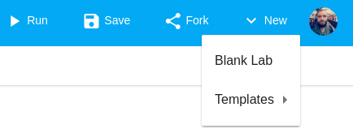
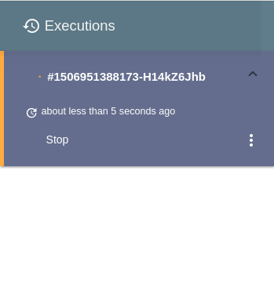
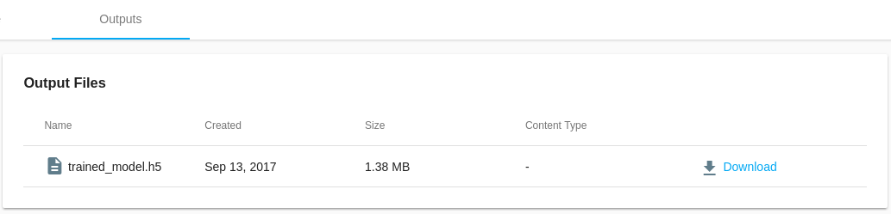

## Introduction

This quickstart will teach you the basics to get up and running which MachineLabs.

We'll be using Keras / TensorFlow and the MNIST dataset to train a simple model how to recognize hand-written digits.

For more details on the data and the model, please refer to the TensorFlow documentation.

## Creating a fresh lab

To create a fresh lab, click the *New* button in the upper right corner. You can either choose to create a lab from an existing template or start from scratch to create a blank lab. For the purpose of this quickstart guide, we'd like to create a blank lab.



## Getting the dataset

To train our model we need to get access to the MNIST dataset.

You may be aware that using Keras we could directly import the MNIST dataset from `keras.datasets`, but for the purpose of this quickstart we'd rather like to fetch it manually so that you learn how to work with datasets when using the MachineLabs platform.

Every lab comes with an `ml.yaml` file by default that sets important configurations for the [execution](executions.html). Jump right in there and add the following section.

```yaml
inputs:
    - name: mnist.npz
      url: https://s3.amazonaws.com/img-datasets/mnist.npz
```

This configures the execution to fetch the `mnist.npz` from the specified Url and save it to `inputs/mnist.npz`. Notice that `inputs` is a special folder inside your code's execution directory which all our configured inputs are downloaded to before the actual execution starts to run the code.

The name that you specify for the input doesn't have to match the actual download name so that you can give different names to files that would otherwise conflict with their names. Notice though that it is mandatory to specify a name for each input even if we don't need a different name.

## Writing the code

Now that we've wired up our input let's write the actual code!

When we create a lab, an empty `main.py` is automatically generated for us.

Go and copy this code over into the `main.py` file.

```python
from __future__ import print_function
import numpy as np
from keras.models import Sequential
from keras.layers.core import Dense, Activation
from keras.optimizers import SGD
from keras.utils import np_utils


# Defines a function to load the MNIST dataset from a local path
def load_data(path):
    f = np.load(path)
    x_train, y_train = f['x_train'], f['y_train']
    x_test, y_test = f['x_test'], f['y_test']
    f.close()
    return (x_train, y_train), (x_test, y_test)

np.random.seed(1671) # for reproducibility

# network and training

NB_EPOCH = 200
BATCH_SIZE = 128
VERBOSE = 1
NB_CLASSES = 10 # number of outputs = number of digits
OPTIMIZER = SGD()
N_HIDDEN = 128
VALIDATION_SPLIT= 0.2 # how much TRAIN is reserved for VALIDATION

# data: shuffled and split between train and test sets
(x_train, y_train), (x_test, y_test) = load_data('inputs/mnist.npz')

# x_train is 60000 rows of 28x28 values --> reshaped in 60000 x 784
RESHAPED = 784

x_train = x_train.reshape(60000, RESHAPED)
x_test = x_test.reshape(10000, RESHAPED)
x_train = x_train.astype('float32')
x_test = x_test.astype('float32')

# normalize

x_train /= 255
x_test /= 255

print (x_train.shape[0], 'train samples')
print (x_test.shape[0], 'test samples')

# convert class vectors to binary class matrices
y_train = np_utils.to_categorical(y_train, NB_CLASSES)
y_test = np_utils.to_categorical(y_test, NB_CLASSES)

model = Sequential()
model.add(Dense(NB_CLASSES, input_shape=(RESHAPED,)))
model.add(Activation('softmax'))
model.summary()

model.compile(loss='categorical_crossentropy', optimizer=OPTIMIZER, metrics=['accuracy'])

history = model.fit(x_train, y_train, batch_size=BATCH_SIZE, epochs=NB_EPOCH, verbose=VERBOSE, validation_split=VALIDATION_SPLIT)
score = model.evaluate(x_test, y_test, verbose=VERBOSE)

print('Saving trained model in ./outputs/trained_model.h5')
model.save('outputs/trained_model.h5')

print('Test score:', score[0])
print('Test accuracy', score[1])
```

Notice that this is largely identical with the official keras MNIST example with the only difference that we are defining a custom function to load the MNIST dataset from `inputs/mnist.npz` because we configured our `ml.yaml` to fetch it and put it there.

```python
# Defines a function to load the MNIST dataset from a local path
def load_data(path):
    f = np.load(path)
    x_train, y_train = f['x_train'], f['y_train']
    x_test, y_test = f['x_test'], f['y_test']
    f.close()
    return (x_train, y_train), (x_test, y_test)
```

Later in the code we call the function with `inputs/mnist.npz` to get our training data.

```python
# data: shuffled and split between train and test sets
(x_train, y_train), (x_test, y_test) = load_data('inputs/mnist.npz')
```

## Starting our execution

Now that we've setup our lab with all the code that we need to train our net, let's start the actual execution. The code will be executed on a MachineLabs server. 

All we have to do is to click on the *Run* button.


### Observing the execution output

Notice that the view switches to the console and we can observe the status of the download followed by the actual output of our `main.py` script. All `stdout` / `stderr` messages will appear in the console.


The console view gives us an infinite real time stream of our running process. We can watch it but we can also just do something else (even close the browser) and come back at a later point. Whenever we come back to a running execution we will continue to observe the live output.

<p class="tip">Notice that every time we start observing an execution that already has produced a large amount of output, the console view presents us with a reasonable sized **chunk from the beginning**, a reasonable sized **chunk from the end** in addition to all **further live messages**</p>

### Controlling our executions

While our execution is running you can move on and do other things including (surprise!) start other executions. Each execution is put in the sidebar and we can control our executions from there.

The most obvious action we may want to take is to *stop* a running execution which can be done with a click on the *Stop* button.



<p class="tip">During our **Private Beta Program** a maximum of two concurrent executions is allowed.</p>

## Saving outputs

Watching the real time console output of our execution is fun but chances are that we actually want to preserve and download some generated files such as the trained model.

Fortunately, preserving any files that our execution produces (train model, graphics, logs etc) is really simple. Whatever we write to the special `outputs` directory will automatically get uploaded and become available in the *Outputs* view of the execution.

In fact, if we take a closer look at our source code we'll see that we save the model to `outputs/trained_model.h5`.

```python
model.save('outputs/trained_model.h5')
```

<p class="tip">During our **Private Beta Program** a maximum of 5 files, each with a maximum file size of 5 MB can be persisted</p>



### Downloading outputs

Outputs can be downloaded directly from the *Outputs* view by clicking on the *Download* button next the specific output

<p class="tip">In the near future, outputs will also be available via a REST API which will enable more advanced use cases</p>

## Wrapping up

Congrats! You've just successfuly trained your first neural net to recognize hand-written digits.

This was a quick run through. We recommend to read on and dive deeper into each specific section to learn more about all the things that you can do with MachineLabs.